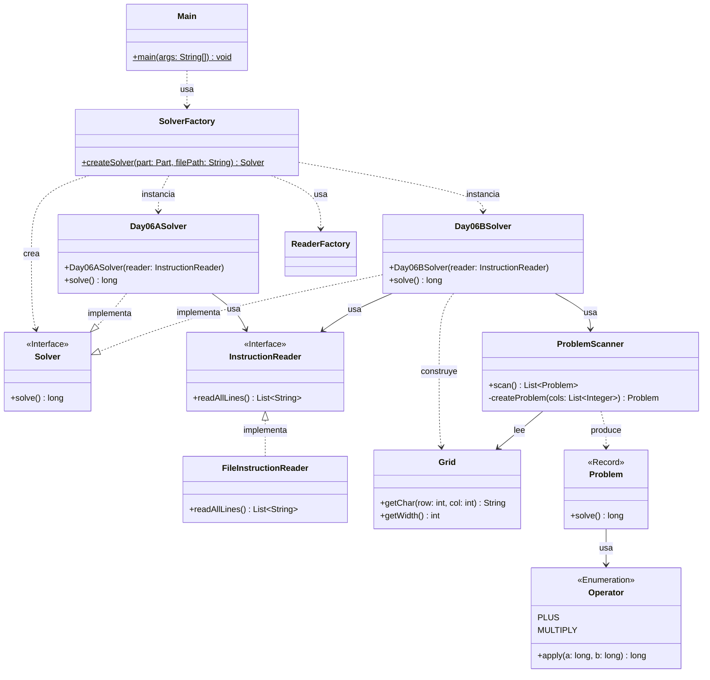

# Advent of Code 2025 - Día 6: Cephalopod Math

Este proyecto contiene la solución para el **Día 6** del Advent of Code 2025: _Cephalopod Math_. El desafío se centra en el análisis de operaciones matemáticas presentadas en diferentes formatos (líneas de texto y cuadrículas), requiriendo un diseño flexible capaz de interpretar y ejecutar instrucciones variables.

## Diseño y Arquitectura

En este proyecto se aplican estrictamente los principios SOLID y Clean Code, junto con patrones de diseño estratégicos para garantizar un código mantenible, extensible y testeable. Se ha optado por una arquitectura simplificada que centraliza la lógica del día en un único paquete cohesivo.

### 1. Principios SOLID

- **Single Responsibility Principle (SRP)**:
  - `SolverFactory`: Responsable únicamente de la creación de los objetos Solver adecuados según la parte del problema ("A" o "B").
  - `FileInstructionReader`: Responsable de la lectura de bajo nivel del archivo de entrada.
  - `Day06ASolver`: Contiene la lógica específica para resolver ecuaciones lineales simples (Parte A).
  - `Day06BSolver`: Orquesta la resolución de problemas complejos basados en cuadrículas (Parte B), delegando el análisis al `ProblemScanner`.
  - `Grid`: Estructura de datos inmutable que representa la cuadrícula de caracteres.
  - `ProblemScanner`: Servicio de dominio encargado de identificar ("escanear") problemas matemáticos dentro de la cuadrícula.
- **Open/Closed Principle (OCP)**:
  - El sistema es extensible para nuevas partes (ej. Parte C) implementando la interfaz `Solver` sin modificar el código existente en `Main` o en los otros solvers.
- **Liskov Substitution Principle (LSP)**:
  - `Day06ASolver` y `Day06BSolver` implementan la interfaz `Solver`, permitiendo que `Main` los utilice indistintamente.
- **Interface Segregation Principle (ISP)**:
  - `InstructionReader` define un contrato mínimo (`readAllLines`), evitando dependencias innecesarias de métodos de lectura complejos no utilizados por todos los clientes.
- **Dependency Inversion Principle (DIP)**:
  - Los módulos de alto nivel (`Main`, Solvers) dependen de abstracciones (`Solver`, `InstructionReader`), desacoplándose de los detalles de implementación como el sistema de archivos.

### 2. Patrones de Diseño

Se han implementado patrones estándar de la industria:

- **Strategy Pattern (Estrategia)**:
  - La interfaz `Solver` define la estrategia común. `Day06ASolver` y `Day06BSolver` son implementaciones concretas intercambiables que encapsulan algoritmos distintos.
- **Factory Pattern (Fábrica)**:
  - `SolverFactory`: Encapsula la lógica de creación de los solvers, inyectando las dependencias necesarias.
  - `ReaderFactory`: Centraliza la creación del lector de instrucciones.
- **Dependency Injection**:
  - `InstructionReader` se inyecta en los constructores de los Solvers. `Grid` se inyecta en `ProblemScanner`. Esto promueve un acoplamiento débil y facilita el testing.

### 3. Clean Code

- **Meaningful Names**: Nombres de clases y métodos que revelan intención (`solve`, `extractNumber`, `scan`).
- **Separation of Concerns**: Distinción clara entre infraestructura (Input/Output), orquestación (Solvers) y lógica de dominio pura (`Operator`, `Problem`).
- **Records**: Uso de Java Records (`Problem`) para objetos de transferencia de datos inmutables y concisos.

### 4. Diagrama de Arquitectura

### 5. Estructura del Proyecto

Todos los componentes principales se encuentran bajo el paquete `software.aoc.day06`, promoviendo la cohesión y simplificando la navegación:

- **Interfaces y Factorías**: `Solver`, `InstructionReader`, `SolverFactory`, `ReaderFactory`.
- **Implementaciones**: `Day06ASolver`, `Day06BSolver`, `FileInstructionReader`.
- **Dominio**: `Grid`, `ProblemScanner`, `Problem`, `Operator`, `NumberParser`.
