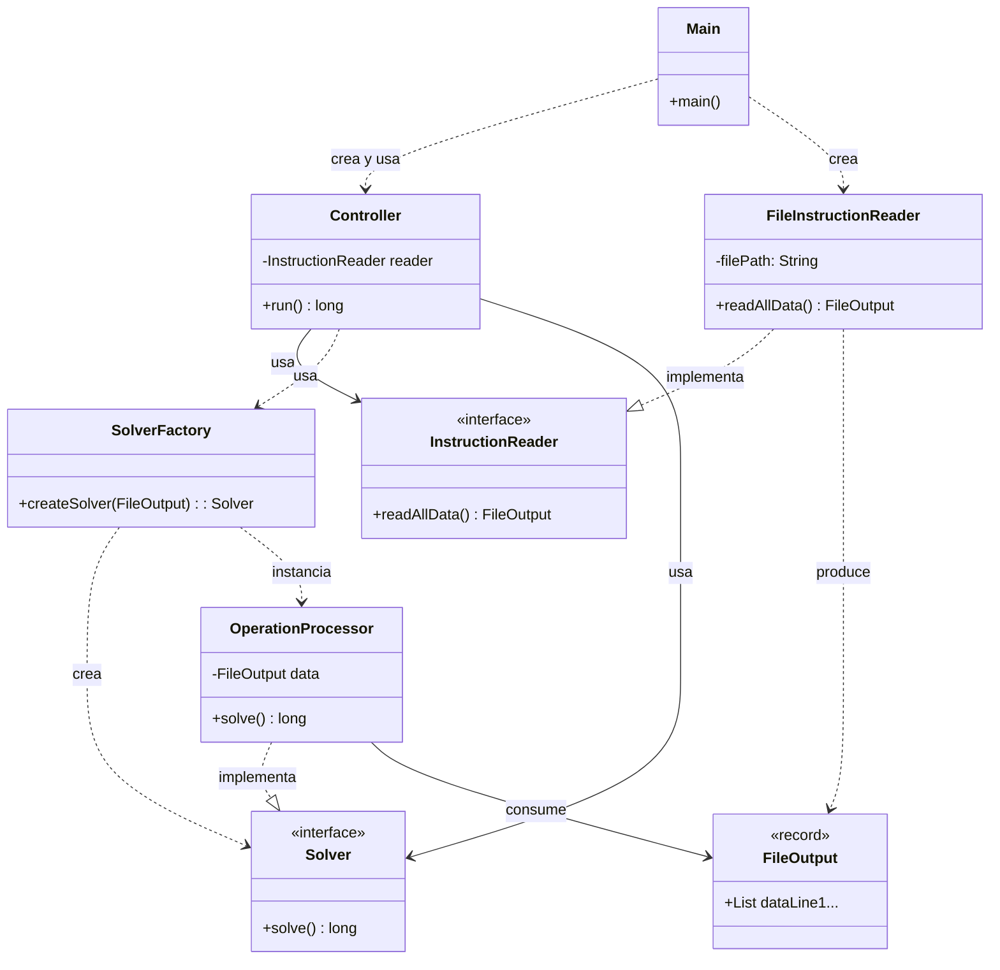
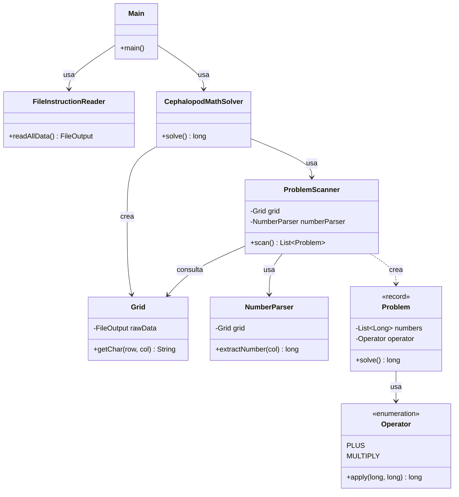

# Advent of Code 2025 - Día 6: Cephalopod Math

Este repositorio contiene la solución para el Día 6 del Advent of Code 2025. El enfoque principal ha sido aplicar principios de ingeniería de software robustos (SOLID, Clean Code) y patrones de diseño adecuados para garantizar un código mantenible, legible y extensible.

## Principios de Diseño y Arquitectura

El proyecto se divide en dos partes (`a` y `b`), donde la parte `b` representa una evolución en la complejidad y robustez de la solución.

### Principios Generales Aplicados

- **Single Responsibility Principle (SRP)**: Cada clase tiene una única responsabilidad. Por ejemplo, `FileInstructionReader` se encarga exclusivamente de la entrada de datos, mientras que `OperationProcessor` (en la parte A) y `CephalopodMathSolver` (en la parte B) manejan la lógica de negocio.
- **Clean Code**: Se ha priorizado la legibilidad mediante nombres descriptivos de métodos y variables, evitando "números mágicos" y encapsulando lógica compleja en métodos privados auxiliares.
- **Inmutabilidad**: Uso extensivo de `record` (como `FileOutput`, `Problem`) para garantizar que los datos transferidos no se modifiquen inesperadamente, favoreciendo la seguridad en hilos (aunque no se use concurrencia aquí) y la predictibilidad.

---

## Parte A: Solución con Arquitectura MVC

En la primera parte, hemos implementado una solución estructurada bajo el patrón **Modelo-Vista-Controlador (MVC)**, garantizando una estricta separación de responsabilidades y un flujo de control claro.

### Decisiones Técnicas y Patrones

1.  **Patrón MVC (Model-View-Controller)**:

    - **Vista (`Main`)**: En este diseño simplificado, la clase `Main` actúa como la Vista. Es responsable de iniciar la aplicación, inyectar dependencias y mostrar el resultado final por consola.
    - **Controlador (`Controller`)**: Recibe las dependencias y coordina el flujo de ejecución (lectura -> resolución -> retorno de resultado).
    - **Modelo**: Compuesto por `OperationProcessor`, `FileInstructionReader` y las estructuras de datos.

2.  **Inversión de Dependencias (ISP/DIP)**:

    - **`InstructionReader` Interface**: Se ha desacoplado la lectura de datos de la implementación concreta de archivos. El `Controller` solo conoce esta interfaz.
    - **`Solver` Interface**: Define el contrato para resolver el problema, permitiendo intercambiar implementaciones.

3.  **Factory Method Pattern**:
    - **`SolverFactory`**: Centraliza la creación del objeto `Solver` adecuado.

### Diagrama de Clases (Parte A - MVC)

---

## Parte B: Solución Avanzada (Modelado de Dominio)

La segunda parte introduce una complejidad mayor en el parsing (columnas variables, estructura de grid). Para manejar esto, la arquitectura evoluciona hacia un diseño más orientado a objetos y al dominio.

### Decisiones Técnicas y Patrones

1.  **Grid Abstraction (Gestión de Estructuras de Datos)**:

    - Se introduce `Grid` para abstraer el acceso a los datos crudos. Esto permite consultar coordenadas `(x, y)` sin preocuparse por los límites de las listas subyacentes, encapsulando la manejo de errores de índice.

2.  **Strategy Pattern (vía Enum)**:

    - La clase `Operator` es un Enum que encapsula la lógica de cada operación aritmética (`+`, `*`). Esto cumple con el **Open/Closed Principle (OCP)**: si se añaden nuevos operadores en el futuro (ej. `-` o `/`), solo se modifica el Enum, sin tocar la lógica de resolución de problemas.

3.  **Separation of Concerns (Parsing vs Solving)**:

    - **`ProblemScanner`**: Su única responsabilidad es _identificar_ problemas dentro del `Grid`. No los resuelve. Implementa una lógica de escaneo visual (de derecha a izquierda) similar a como lo haría un humano.
    - **`NumberParser`**: Extrae valores numéricos de columnas, aisladando la lógica de parsing de texto sucia.
    - **`Problem`**: Representa un problema matemático válido y autocontenido. Sabe cómo resolverse a sí mismo (Information Expert), delegando la operación matemática al `Operator`.

4.  **Gestión de Flujos de Datos**:
    - El flujo es `Raw File -> Grid -> ProblemScanner -> List<Problem> -> Result`. Cada transformación refina los datos, pasando de texto sin estructura a objetos de dominio rico.

### Diagrama de Clases (Parte B)

