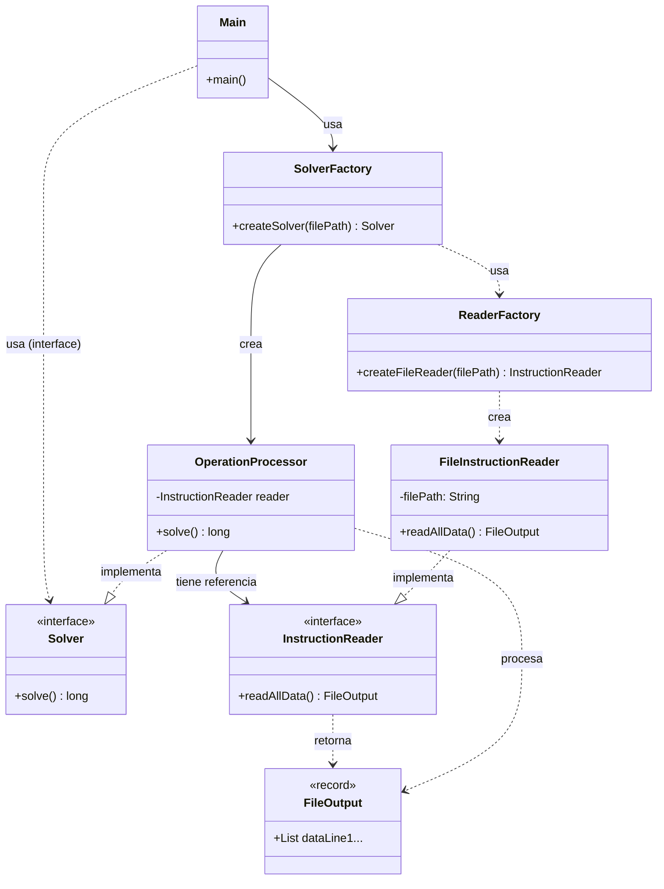
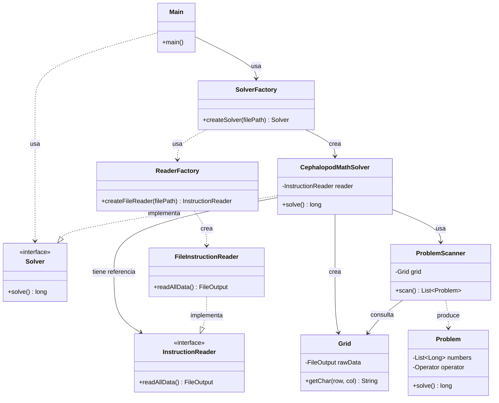

# Advent of Code 2025 - Día 6: Cephalopod Math

Este repositorio contiene la solución para el Día 6 del Advent of Code 2025. El enfoque principal ha sido aplicar principios de ingeniería de software robustos (SOLID, Clean Code) y patrones de diseño adecuados para garantizar un código mantenible, legible y extensible.

## Principios de Diseño y Arquitectura

El proyecto se divide en dos partes (`a` y `b`), donde la parte `b` representa una evolución en la complejidad y robustez de la solución.

### Principios Generales Aplicados

- **Single Responsibility Principle (SRP)**: Cada clase tiene una única responsabilidad. Por ejemplo, `FileInstructionReader` se encarga exclusivamente de la entrada de datos, mientras que `OperationProcessor` (en la parte A) y `CephalopodMathSolver` (en la parte B) manejan la lógica de negocio.
- **Clean Code**: Se ha priorizado la legibilidad mediante nombres descriptivos de métodos y variables, evitando "números mágicos" y encapsulando lógica compleja en métodos privados auxiliares.
- **Inmutabilidad**: Uso extensivo de `record` (como `FileOutput`, `Problem`) para garantizar que los datos transferidos no se modifiquen inesperadamente, favoreciendo la seguridad en hilos (aunque no se use concurrencia aquí) y la predictibilidad.

---

## Parte A: Solución con Factories y Main Orchestrator

Hemos refactorizado la solución para eliminar el Controlador y utilizar un enfoque más directo donde el `Main` orquesta el flujo utilizando Factorías, siguiendo el patrón de inyección de dependencias manual.

### Decisiones Técnicas y Patrones

1.  **Orquestación en Main**:

    - `Main` es el punto de entrada y coordina el alto nivel, delegando la creación de componentes a las factorías.

2.  **Factory Pattern (Doble Nivel)**:

    - **`SolverFactory`**: Crea la instancia de `Solver`. Encapsula el conocimiento de "qué solver y qué lector necesito".
    - **`ReaderFactory`**: Especializada en crear el `InstructionReader`. `SolverFactory` la utiliza.

3.  **Solver como "Smart Worker"**:
    - A diferencia de la versión anterior, `OperationProcessor` (nuestro Solver) ahora recibe un `InstructionReader` en lugar de datos crudos. Es responsable de solicitar la lectura cuando sea necesario (Lazy Loading o bajo demanda), encapsulando mejor el ciclo completo de resolución.

### Diagrama de Clases (Parte A)

---

## Parte B: Solución Avanzada con Factories

Hemos extendido el patrón de Factorías a la Parte B para mantener la consistencia arquitectónica, adaptándolo al dominio más complejo de esta sección.

### Diagrama de Clases (Parte B)

